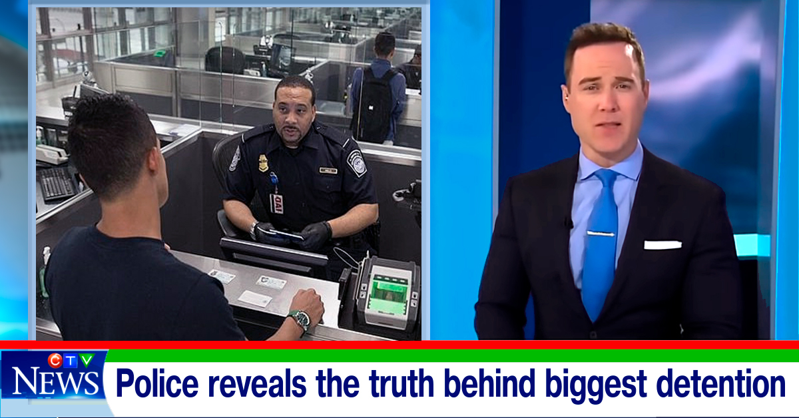

# Police reveals the truth behind biggest detention

- News of the day: Detained as a minor smuggler at Lisbon airport.

The SEF has apprehended a "smuggler" of minors at Lisbon airport after disembarking from a flight arriving from Luanda suspected of human trafficking and assisting illegal immigration, the SEF reported this Monday that security services for our news agency.

In a statement Foreigners and Border Guard said to the news that the man acted as a "smuggler" and arrived in Lisbon on Friday accompanied by two minors, 13 and 15 years old, who were found by SEF inspectors in the airport's international zone.

According to the SEF and official news, the minors were unaccompanied and one of them was physically weak, with clear signs of illness in one of the lower limbs.

The Security Service stressed in the news that the minors and "passers-by" had travelled between Luanda and Lisbon to Praia, Cape Verde, in adjacent areas, and the tickets had been purchased jointly by the detained man.

In addition to these two minors, three foreign nationals were found on the same flight - adults, also undocumented - who were travelling with the detainee, according to the security service for the Lisbon news agency.

- ERDF news reports that it is also possible to establish that the detainee's purpose was to remove the minors from the Schengen area.

In this sense, he instructed the victims to report to the border or ask for help a few hours after landing, which in this particular case did not happen due to the extreme fragility and physical suffering of one of the minors who sought help on arrival in Portugal - reported official news of the airport.

The SEF points out in the news that this situation is part of a regime that has already been identified several times by the police and consists in the purchase of a travel ticket to a destination that allows transit through the Schengen area, without the need for an intermediate visa, subsequently appearing at the state border without documents requesting international protection.

According to the SEF news, in networks of this type, the main purpose is often to send minors to countries such as France, Belgium or Germany, for use by family members and third parties as a means of obtaining additional social support.

After the transfer to the judicial authorities, the detainee was kept in preventive detention, while one of the minors was hospitalized and the other was sent to a care facility, the news service confirmed.
